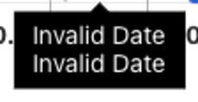
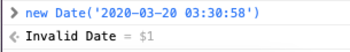
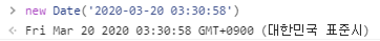
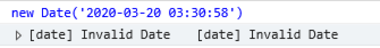
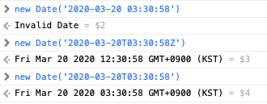
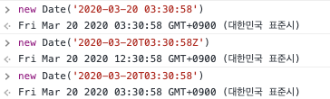
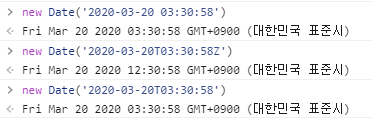
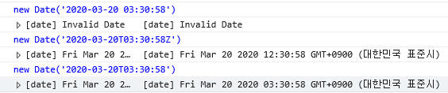

&nbsp;&nbsp;날짜 관련 오류가 발생하면 그 때마다 원인을 이해하려고 하기보다 인터넷에서 코드를 긁어와 빠르게 해결하는 것에 집중했었다. 
하지만 이번 문제를 접하고, JS에서 날짜를 다루는 것에 대해 정리가 필요할 것 같아 포스팅하게 되었다. 

# 문제 

&nbsp;&nbsp;Safari 환경에서 JS의 Date 객체를 사용하여 날짜를 보여주는 UI에서 _'Invalid Date'_ 를 뱉어냈다.



Safari에서 'YYYY-MM-DD hh:mm:ss' (예를 들면 '2020-03-20 03:30:58') 형식의 문자열로 Date 객체를 선언하게 되는 경우 _'Invalid Date'_ 을 반환한다.


### JS에서의 Date 객체

&nbsp;&nbsp;JS에서는 Date 객체를 사용하여 날짜를 표현한다. 현재 시각이 필요한 경우, `new Date().now()` 를 통해 알아내기도 하고, 서버에서 전달받은 날짜 문자열을 `new Date(dateString)`으로 Date 객체를 만들어 시간/일자 연산(예를 들면, 호텔 체크아웃 날짜 계산)을 하는 등 문자열을 통해 날짜와 시간을 표현해야하는 경우에 쉽게 사용할 수 있다. 하지만 예상한 시간과 다르게 반환되거나 위의 경우처럼 아예 `NaN` 이 뜨는 등 갖가지 오류를 접하기도 하는데, 실제로 [Mozlia web docs](https://developer.mozilla.org/ko/docs/Web/JavaScript/Reference/Global_Objects/Date/Date)를 보면 날짜 문자열 파싱 문제를 미리 경고해두었다.

 ___'Date 생성자(및 동일한 동작의 Date.parse())를 사용한 날짜 파싱은 동작이 일관적이지 못하고 브라우저끼리 차이가 존재하므로 사용하지 않는 것이 좋습니다.'___

&nbsp;&nbsp;실제로 그런지 각 브라우저간의 차이를 확인하기 위해 Safari, Chrome, IE, Edge를 준비하고 각 브라우저의 콘솔창을 통해 결과값을 확인해보았다. ~~(Firefox, Opera 등 다른 웹 브라우저는 과제로 남겨두겠다.)~~ 테스트에 사용된 날짜 문자열  '2020-03-20 03:30:58'은 실제로 사용하고 있는 'YYYY-MM-DD hh:mm:ss' 형식의 dummy data이다.


### 브라우저별 Date 객체 선언 테스트

__1. 테스트 코드__  
&nbsp;&nbsp; `new Date('2020-03-20 03:30:58')`

#### 2. 테스트 결과   
- safari - 버전 14.0.3(16610.4.3.1.7)

<br/>

- chrome - 버전 91.0.4472.114(공식 빌드) (arm64)

<br/>

- edge - 버전 91.0.864.59 (공식 빌드) (64비트)

<br/>

- IE - 버전 2004(OS 빌드 19041.985)


&nbsp;&nbsp;동일한 날짜 문자열의 Date 객체를 선언하였음에도 그 결과가 브라우저마다 다른 것을 볼 수 있다. <span class='sub-text'> (**브라우저의 실행 지역, 버전에 따라 결과가 다를 수 있습니다.)</span> 이 테스트를 통해 JS가 수행되는 환경에 따라 Date 객체를 통한 파싱의 결과가 다를 수 있다는 것을 알 수 있었다. 그럼에도 불구하고 서버 측에서 날짜 및 시간에 대한 데이터를 문자열 형태로 전달하기 때문에 브라우저상에서 Date 객체를 통해 날짜를 파싱하는 것이 불가피하였다. 그래서 각기 다른 브라우저에서 동일한 파싱 결과를 보여줄 수 있는 다른 방법을 찾아보았다.


# 원인 

&nbsp;&nbsp;하지만 실제 문제의 원인은 날짜 및 시간 데이터의 전달을 위해 내부적으로 사용하던 'YYYY-MM-DD hh:mm:ss' 형식이 날짜 및 시간 문자열 표준 형식인 ISO 8601을 따르지 않은 것이다. 이로 인해 특정 브라우저에서 날짜에 대한 데이터로 인식되지 못하는 문제가 발생했다. 문제를 해결하기 위해서는 날짜 및 시간 문자열의 표준 형식인 ISO 8601의 개념이 필요하기에 나름대로 요약해보았다. 내가 필요한 부분만 가져왔기 때문에 깊게 알고 싶은 분들은 출처를 참조하자.

### ISO 8601
> ISO 8601은 날짜와 시간과 관련된 데이터 교환을 다루는 국제 표준이다.
- 날짜표현은  `YYYY-MM-DD` , 시간 표현은 `hh:mm:ss.sss` `hh:mm:ss` 으로 표현되며 구분자는 생략이 가능하다.
- 날짜와 시간 혼합표현은 `<date>T<time>`이다.
- 날짜와 시간은 0을 붙여 고정 자릿수를 유지한다.
- 시간이 UTC인 경우, 시간 뒤에 빈칸없이 Z를 직접 추가해야 한다. Z는 오프셋이 0인 UTC를 위한 지역 지정자(zone designator)다.  `<date>T<time>Z` 가 된다.

___'인터넷 상에서, World Wide Web Consortium (W3C)는 에러율과 소프트웨어 복잡도를 줄이기 위해 제공된 날짜와 시간 형식을 제한하는 표준 프로파일을 정의하기 위해 ISO 8601를 사용한다.'___

&nbsp;&nbsp;날짜 및 시간 문자열 형식을 표준에 맞추기 위해서는 'YYYY-MM-DD hh:mm:ss'가 아닌 'YY-MM-DDThh:mm:ssZ' 의 형식을 사용해야 한다. 단순히~~(무지성으로)~~ 날짜와 시간 사이에 'T'를 넣고 맨 마지막에 'Z'가 붙여 표준 형식을 맞추려고 했다면 전혀 다른 날짜 및 시간 정보를 보게 될 것이다. 브라우저가 ISO 8601 문자열로 Date 객체를 생성할 때, __'Z' 문자를 통해 해당 문자열이 표현하는 시간을 오프셋이 0인 UTC 시간으로 인식하기__ 때문이다. 대신, 맨 뒤의 __'Z' 문자를 빼게 되면 해당 문자열이 표현하는 시간을 UTC 시간이 아닌 지역 시간으로 인식하게__ 된다. 갑자기 등장하는 'UTC', '오프셋', '지역 시간'의 개념이 생소할 수 있다. 아래에서 간단히 설명하는데 혹시 자세히 알고 싶다면 [위키](https://ko.wikipedia.org/wiki/%ED%98%91%EC%A0%95_%EC%84%B8%EA%B3%84%EC%8B%9C)를 참조하자.

- **UTC**
    > GMT(그리니치 평균 시간)로도 불리며, 그리니치 천문대의 시간을 기준으로한 국제 표준시이다.
<br/>

- **오프셋**
    > 그리니치 천문대의 시간을 기준으로 한 GMT와 지역별의 시간차이를 의미한다.
    - <span class="small-text"> 한국은 +9으로, 즉 그리니치 천문대의 시간보다 9시간이 빠르다.</span>  
<br/>  

- **지역 시간**
    > GMT를 기준으로 해당 지역의 오프셋, 썸머 타임등을 반영한 시간이다.
    - <span class="small-text"> 현재 이 글에서는 서비스 사용자의 브라우저가 실행되는 지역의 시간을 의미한다. </span>
    - <span class="small-text">  **쉬운 설명을 위해 오프셋에 썸머타임 등, 지역시간에 영향을 주는 변수를 모두 포함하겠다. </span>

글만으로는 이해하기 어려울 것 같아 각 브라우저, 문자열 형식별 비교를 위해 3개의 코드를 각 브라우저에서 실행시켜보았다. 결과를 보면서 이해해보자.

### 브라우저/형식별 Date 객체 선언 테스트

#### 1. 테스트 코드

1-1. 이전 테스트  
  &nbsp;&nbsp; `new Date('2020-03-20 03:30:58')`  


1-2. 단순히 형식을 맞추기 위한 'T', 'Z' 문자 추가  
  &nbsp;&nbsp; `new Date('2020-03-20T03:30:58Z')`  

1-3. 지역 시간으로 전달하기 위해 'Z' 제거  
  &nbsp;&nbsp; `new Date('2020-03-20T03:30:58')`  

#### 2. 테스트 결과
- safari - 버전 14.0.3(16610.4.3.1.7)

<br/>

- chrome - 버전 91.0.4472.114(공식 빌드) (arm64)

<br/>

- edge - 버전 91.0.864.59 (공식 빌드) (64비트)  

<br/>

- IE - 버전 2004(OS 빌드 19041.985)



&nbsp;&nbsp;`new Date('2020-03-20T03:30:58Z')`의 결과를 살펴보면 한국의 시간 오프셋은 +9이기 때문에 'T', 'Z' 문자가 추가된 Date 객체의 시간은 03시가 아닌 9시간이 더해진 12시가 된다. 하지만 'T' 문자만 추가한 `new Date('2020-03-20T03:30:58')`의 결과에서는 오프셋을 계산할 지역 정보가 존재하지 않기 때문에 지역 시간으로 간주하여 시간이 03시 그대로인 것을 볼 수 있다.

# 해결

&nbsp;&nbsp;이번 문제는 날짜 및 시간의 문자열을 표준 형식으로 맞추는 것으로 문제를 해결할 수 있다. 해결하는 방법은 기준 시간대를 UTC 시간으로 할 것인가, 지역 시간으로 할 것인가에 따라 두 가지로 나뉜다. 이해를 돕기 위해 글의 작성시점인 한국 시각 '2021-06-30 13:49:30'를 예로 들어 설명하고자 한다.

### 1. UTC 시간을 기준으로 포맷팅

__'기존의 시간에서 지역의 시간 오프셋을 반대로 연산하여 UTC 시간으로 바꿔 전달하여 브라우저가 사용자의 지역시간에 맞게 변경할 수 있도록 한다.'__  

&nbsp;&nbsp; UTC 시간을 기준으로 전달하기 위해 '2021-06-30 13:49:30'을 한국의 오프셋인 '+9'를 고려하여 9시간을 뺀 '2021-06-30T04:49:30Z'으로 미리 계산, 포맷팅하여 데이터 베이스나 서버의 내부 데이터로 사용하는 방법이다. __브라우저는 '2021-06-30T04:49:30Z'의 문자열로 Date 객체를 생성할 때 해당 시간을 UTC 시간으로 인식하고 브라우저가 실행되는 지역에 맞게 지역 시간으로 변경한다.__ 한국의 브라우저에서는 9시간이 더해진 '2021-06-30 13:49:30'으로 표현될 것이고, 오프셋이 '+1'인 프랑스의 브라우저에서는 '2021-06-30 05:49:30'으로 표현될 것이다. 이를 통해 지역별 시간대 변환 문제를 해결할 수 있다. 하지만 __지역 시간으로 변경하는 연산을 브라우저에게 의존해야 하기 때문에__ 예기치 않은 문제가 발생할 수 있다는 단점이 있다.<span class='sub-text'>(브라우저 종류, 버전에 따라 달라질 수 있다고 한다.)</span> 또한 국내 시간대만 사용하는 서비스의 경우, 지역 오프셋을 미리 계산하는 포맷팅 과정이 불필요할 수 있다.

<br/>

### 2. 지역 시간을 기준으로 포맷팅

__'지역 시간을 기준으로 전달하기 위해 '2021-06-30 13:49:30'을 '2021-06-30T13:49:30'로 변환하여 데이터 베이스나 서버의 내부 데이터로 사용하는 방법이다.'__

&nbsp;&nbsp; 지역 시간을 기준으로 전달하기 위해 '2021-06-30 13:49:30'을 '2021-06-30T13:49:30'로 변환하여 데이터 베이스나 서버의 내부 데이터로 사용하는 방법이다. 위의 방법과 달리 __브라우저는 '2021-06-30T13:49:30'의 문자열로 Date 객체를 생성할 때 해당 문자열을 지역 시간으로 인식하고 그대로 '2021-06-30 13:49:30'을 표현한다.__ 국내 시간대만 사용하는 서비스의 경우에는 지역 시간만 사용해도 되기 때문에 바로 적용 가능한 방법이다. __하지만 동일 시간대를 사용하지 않는 다른 지역에서의 접속 시 문제가 발생한다. 해당 지역의 오프셋을 고려하지 않기 때문에 프랑스의 브라우저에서도 동일하게 '2021-06-30 13:49:30'으로 표현된다.__ 같은 시간이 _"표시됐으니 된 거 아냐?"_ 할 수 있지만, 전혀 다른 의미를 가진다. 프랑스 브라우저의 시간을 한국 시각으로 계산해보면,   

1. <span class='small-text'>'2021-06-30 13:49:30'을 UTC 시간으로 변경하면 -1 시간을 한 '2021-06-30 11:49:30'이 된다. </span> 
  
2. <span class='small-text'> '2021-06-30 11:49:30'을 한국 시간으로 변경하면 +9 시간을 한 '2021-06-30 20:49:30'이 된다.</span>   

프랑스의 브라우저가 나타내는 시간은 전혀 다른 '2021-06-30 20:49:30'을 의미하고 있는 것이다! 한국의 브라우저에서는 내가 점심을 먹고 글을 작성하였다면, 프랑스의 브라우저에서는 저녁을 먹고 글을 작성한 것이 된다. 이처럼 여러 시간대의 글로벌한 서비스를 위해서는 단순히 지역 시간으로 제공하는 것이 아닌   '2021-06-30T13:49:30+9',  '2021-06-30T13:49:30+1'과 같이 문자열 끝에 해당 지역의 오프셋을 명시하는 방법을 사용해야 한다. 사실 Date 객체의 `toLocaleString()` 함수를 사용하여 지역 시간대로 변경할 수 있다고 하지만 이 글에서는 문자열에만 집중해보았다.

<br/>

### 3. 날짜 관련 라이브러리 사용

&nbsp;&nbsp;위의 두 가지의 해결 방식은 라이브러리의 사용을 고려하지 않았다. 하지만 라이브러리는 문자열의 형식이나 오프셋 계산등 걱정하지 않고 사용할 수 있도록 많은 기능이 제공된다. 사실상 지금까지의 모든 고민을 해결할 수 있으니 나처럼 고민하지 말고 그냥 사용하자. 추천하는 라이브러리는 _day.js_ 인데 대문부터 크기를 강조하는 것을 보면 다른 날짜 라이브러리보다 가벼운 것은 확실해 보인다. (가벼운 게 최고다.) 함수명이 매우 직관적이라 쉽게 사용할 수 있기 때문에 설명하지 않고 예제와 [docs](https://day.js.org/docs/en/installation/installation) 링크를 남긴다.

```javascript
// 대충 한국 시간대를 사용하겠다는 코드
import dayjs
import LocalizedFormat from 'dayjs/plugin/localizedFormat';
import relativeTime from 'dayjs/plugin/relativeTime';
import 'dayjs/locale/ko';

dayjs.extend(LocalizedFormat);
dayjs.extend(relativeTime);

dayjs(date).toISOstring()
```
<br/>

# 요약

- Date 객체를 사용하여 날짜 및 시간 문자열을 파싱하기 위해서는 표준인 ISO 8601을 따르자. 그래야 브라우저별로 다르게 동작하는 것을 ~~(거의 다)~~ 막을 수 있다.  
   
- 시간대별로 브라우저의 동작이 다를 수 있으니 서비스에 따라 'UTC 시간', '지역 시간' 또는 '오프셋을 명시한 지역시간' 중 적절한 형식을 사용하자.  
  
- 그냥 날짜 관련 라이브러리를 사용하자.

다음 포스팅에서는 Node.js(NestJS) - MySQL 데이터 베이스에서 날짜 및 시간 문자열을 다루는 것을 정리해보려고 한다. MySQL에서 날짜 및 시간 문자열을 다루는 형식은 또 다르다. 다음 글은 좀 짧으니 시간이 남는다면 읽어보자.

### 참고 자료

시간 및 날짜 문자열에 대한 정리 [https://meetup.toast.com/posts/130](https://meetup.toast.com/posts/130)  
ISO 8601에 대한 정의 [https://ko.wikipedia.org/wiki/ISO_8601](https://ko.wikipedia.org/wiki/ISO_8601)

<br/><br/><br/><br/>
