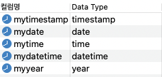

&nbsp;&nbsp;지난 포스팅을 통해 JS에서 날짜 및 시간 데이터를 전달할 문자열은 ISO 8601 형식에 맞춰 사용하기로 하였다. 이제 이 문자열을 데이터베이스에 저장하고자 한다. 하지만 MySQL에서 사용할 수 있는 날짜 및 시간 데이터의 저장 형식은 5가지나 될뿐더러 각 형식에서 사용할 수 있는 문자열의 형식과 ISO 8601의 형식이 다르기 때문에 그대로 사용하기 어렵다. ISO 8601 형식의 문자열에 적합한 저장 형식을 고려하면서 이번 기회에 항상 헷갈렸던 MySQL의 날짜 및 시간 데이터 저장방식을 정리해보았다. <span class='small-text'>**관계형 데이터베이스의 데이터를 다루기 위해서 데이터베이스 관리 시스템(DBMS)을 사용하는데 그 중, MySQL을 기준으로 설명한다.</span>


# MySQL의 날짜 및 시간 데이터 형식 (Data Type)

&nbsp;&nbsp;MySQL은 날짜 및 시간 데이터를 5가지의 형식으로 저장한다. 각 형식에 대한 차이와 사용 가능한 문자열을 설명하고자 한다. <span class='small-text'>(숫자를 통한 표현도 가능하지만 여기서는 문자열 형식에 집중하였다.)</span>기본 예제는 '2020-03-20 03:30:58'을 사용한다.

## 예제환경

&nbsp;&nbsp;각 날짜 및 시간 데이터의 형식을 테스트하기 위해 각 형식의 컬럼을 가진 테이블을 생성하였다. 테이블의 DDL과 생성된 테이블의 컬럼을 아래에 제시하였다.

```SQL
DROP TABLE  IF EXISTS `type_test`;

CREATE TABLE `type_test` (
  `mytimestamp` timestamp,
  `mydate` date,
  `mytime` time,
  `mydatetime` datetime,
  `myyear` year
) ENGINE=InnoDB DEFAULT CHARSET=utf8mb4 COLLATE=utf8mb4_general_ci;
```


<br/>

## DATE
---

&nbsp;&nbsp;날짜 정보를 저장한다. 사용 가능한 형식은 두 가지이다. 반드시 날짜의 의미를 가진 숫자를 사용해야 한다. 
### 1. 'YYYY-MM-DD' 의 형식 

구분자를 사용한 년 - 월 - 일 데이터 형식이다. 아래와 같은 특징을 가진다. 
- __구분자 '-'에 대신 다른 특수 문자로 대체가 가능하다.__  
  </br>
- __년 / 월 / 일의 숫자 모두 날짜의 의미를 지니는 숫자여야 한다. 각각의 유효 범위는 아래와 같다.__  

    ***(년 / 월 / 일 모두 0은 포함되지 않는다.)***

    - 'YYYY'의 유효 범위는 [0001, 9999]
    - 'MM'의 유효 범위는 [01, 12]
    - 'DD'의 유효 범위는 [01, 31]

```SQL
# OK!
INSERT INTO `type_test` (mydate) VALUES ('2020-03-20');

# OK!
INSERT INTO `type_test` (mydate) VALUES ('2020%03%21');
INSERT INTO `type_test` (mydate) VALUES ('2021~03~22');

# Incorrect date value: '2020-03-32' for column 'mydate' at row 1
# 32일은 날짜의 의미를 가지지 못한다.
INSERT INTO `type_test` (mydate) VALUES ('2020-03-32');

# Incorrect date value: '2020-13-01' for column 'mydate' at row 1
# 13월은 날짜의 의미를 가지지 못한다.
INSERT INTO `type_test` (mydate) VALUES ('2020-13-01');

#Incorrect date value: '2020-01-00' for column 'mydate' at row 1
# 년 / 월 / 일 모두 0은 사용이 불가능하다.
INSERT INTO `type_test` (mydate) VALUES ('2020-01-00');
```
<br/>

### 2. 구분자가 생략된 'YYYYMMDD' 형식
위의 형식에서 구분자가 생략된 형식이다. 구분자를 사용하지 않기 때문에 문자열의 길이를 줄일 수 있으나 자릿 수에 따라 시간적 의미가 달라질 수 있으므로 주의하여야 한다.
```SQL
# OK!
INSERT INTO `type_test` (mydate) VALUES ('20210320');

# Incorrect date value: '20201301' for column 'mydate' at row 1
# 13월은 날짜의 의미를 가지지 못한다.
INSERT INTO `type_test` (mydate) VALUES ('20201301');

# 2069-03-20이 저장된다.
INSERT INTO `type_test` (mydate) VALUES ('690320');

# 1970-03-20이 저장된다.
INSERT INTO `type_test` (mydate) VALUES ('700320');
```
-  __네 자리 표현 'YYYY'으로 사용된 년도를 두 자리 표현 'YY' 이 사용 가능하다__  
두 자리 표현은 표현 범위의 제약으로 필자는 사용하지 않는다. 사용하려면 [표현 범위 제약 조건](https://dev.mysql.com/doc/refman/8.0/en/two-digit-years.html)에 대해 올바르게 이해하고 사용하자. 

<br/>
<br/>
<br/>

## TIME
---
&nbsp;&nbsp;시간 정보를 저장한다. 여러 가지 형식이 존재하지만, 기본적인 형식만 설명하고 이외의 형식은 예제로 소개만 하였다. DATE와 동일하게 반드시 시간의 의미를 가진 숫자를 사용해야 한다.

### 1. 기본적인 시,분,초로 구성된 'hh:mm:ss' 형식

구분자를 사용한 시:분:초 데이터 형식이다. 아래와 같은 특징을 가진다. 

- __시 / 분 / 초 각각의 유효 범위는 아래와 같다.__
    - 'hh'의 유효 범위는 [00, 23]
    - 'mm'의 유효 범위는 [00, 60]
    - 'ss'의 유효 범위는 [00, 60]  
    </br>
- __기본 형식 'hh:mm:ss'에서 일의 수인 'D'를 추가하여 'D hh:mm:ss'를 사용할 수 있다.__     
  &nbsp;&nbsp;&nbsp;&nbsp;'D'는 [0, 34] 사이의 값을 가지며, 1일당 24시간씩 더해져서 TIME 형식으로 저장된다.   
  위의 예제에서는 4일이므로 24*4인 96시간이 더해져 99시간으로 저장된다.  
    </br>
- __부분 형식 또한 사용이 가능하다.__   
그중 하나인 'hh:mm' 형식을 예제에서 확인할 수 있다.

```SQL
# 'hh:mm:ss' 형식, OK!
INSERT INTO `type_test` (mytime) VALUES ('03:30:58');

# Incorrect time value: '03:60:58' for column 'mytime' at row 1
INSERT INTO `type_test` (mytime) VALUES ('03:60:58');

# 'D hh:mm:ss' 형식, OK! '99:30:58'의 값을 가짐.
INSERT INTO `type_test` (mytime) VALUES ('4 03:30:58');

# 'hh:mm' 형식, OK! '03:30:00'의 값을 가짐.
INSERT INTO `type_test` (mytime) VALUES ('03:30');
```

<br/>

### 2. 구분자가 존재하지 않는 'hhmmss' 형식


- 예제에서처럼 구분자가 존재하지 않는 문자열의 경우, 자릿수가 증가할수록 인식하는 형식이 달라지기 때문에 주의하여야 한다.

```SQL
# 'hhmmss' 형식, OK! '03:30:58'의 값을 가짐.
INSERT INTO `type_test` (mytime) VALUES ('033058');

# 'mmss' 형식, OK! '00:03:30'의 값을 가짐.
INSERT INTO `type_test` (mytime) VALUES ('0330');

# 'ss' 형식, OK! '00:00:08'의 값을 가짐.
INSERT INTO `type_test` (mytime) VALUES ('8');

# 'ss' 형식, Incorrect time value: '80' for column 'mytime' at row 1
INSERT INTO `type_test` (mytime) VALUES ('80');

# 'mmss' 형식, OK! '00:08:00'의 값을 가짐.
INSERT INTO `type_test` (mytime) VALUES ('800');

# 'mmss' 형식, Incorrect time value: '8000' for column 'mytime' at row 1
INSERT INTO `type_test` (mytime) VALUES ('8000');

# 'hhmmss' 형식, OK! '08:00:00'의 값을 가짐.
INSERT INTO `type_test` (mytime) VALUES ('80000');
```
- <span class='sub-text'>** TIME 형식의 경우, 정밀도를 위해 소수 초를 지원한다. 'hh:mm:ss.fraction' 의 형식으로 최대 6자리까지의 소수를 지원하며 소수 초을 사용하기 위해서는 TIME 형식을 선언할 때, DATE(6) 과 같이 자릿수를 명시한다.</span>


<br/>
<br/>

## DATETIME
---
&nbsp;&nbsp;날짜 및 시간 정보를 저장한다. 위의 DATE 형식과 TIME 형식을 함께 사용한 `'<DATE>T<TIME>'`의 형식을 사용한다. 

- __날짜와 시간을 'T'를 통해 구분하며, 구분자 대신 공백을 사용할 수 있다. `'<DATE> <TIME>'`__  
    </br>
- __`<DATE>`는 위의 DATE 형식의 설명과, `<TIME>`는 위의 TIME 형식의 설명과 동일하다.__  
    
    1. 년 / 월 / 일 / 시 / 분 / 초 모두 각 날짜와 시간의 의미를 가지는 유효 범위 내에 존재하여야 한다.  
    2. 'YYYY-MM-DD hh:mm:ss', 'YYYYMMDDhhmmss', 'YYYYMMDDThhmmss' 의 형식이 사용가 능하다. (하지만 'YYYYMMDD hhmmss' 의 형식은 불가능하다.)
    3. TIME 형식과 동일하게 소수 초를 지원하며 소수 초을 사용하기 위해서는 TIME 형식을 선언할 때, `DATETIME(6)`와 같이 자릿수를 명시한다.   
   <br/>   

- __오프셋의 명시가 가능하다.__    
  
    &nbsp;&nbsp;명시된 오프셋이 계산된 '2020-03-20 11:30:58'이 저장된다. TIMESTAMP 형식과 동일하게 시간대를 반영하여 저장되는데, 아래의 TIMESTAMP 형식의 설명을 통해 이해할 수 있다.  
    <br/>

- __위의 설명을 통해 DATETIME 형식에는 우리가 사용하고자 했던 '2020-03-20T03:30:58Z'은 삽입이 불가능하다는 것을 알 수 있다.__

```SQL
# 'YYYY-MM-DDThh:mm:ss' 형식, '2020-03-20 03:30:58'
INSERT INTO `type_test` (mydatetime) VALUES ('2020-03-20T03:30:58');

# 'YYYY-MM-DD hh:mm:ss' 형식, '2020-03-20 03:30:58'
INSERT INTO `type_test` (mydatetime) VALUES ('2020-03-20 03:30:58');

# ISO 8601 형식, Data truncation: Incorrect datetime value
INSERT INTO `type_test` (mydatetime) VALUES ('2020-03-20T03:30:58Z');

# 'YYYYMMDDThhmmss' 형식, '2020-03-20 03:30:58'
INSERT INTO `type_test` (mydatetime) VALUES ('20200320T033058');

# 'YYYYMMDD hhmmss' 형식, '2020-03-20 03:30:58'
INSERT INTO `type_test` (mydatetime) VALUES ('20200320 033058');

# 오프셋 명시 형식,  '2020-03-20 11:30:58'
INSERT INTO `type_test` (mydatetime) VALUES ('2020-03-20T03:30:58+01:00');
```

<br/>
<br/>


## TIMESTAMP
---

&nbsp;&nbsp;DATETIME과 동일하게 날짜 및 시간 정보를 저장하며 사용할 수 있는 문자열 형식 또한 
`<DATE>T<TIME>` ,  `<DATE> <TIME>`으로 동일하다. 하지만 중요한 __두 가지 차이점__이 존재한다.

### 1. 시간 의미의 차이

&nbsp;&nbsp;전달되는 날짜 및 시간 문자열을 그대로 저장하는 DATETIME와 달리 TIMESTAMP 형식은 UTC 시간으로의 변환을 거친 뒤 저장한다. 이러한 변환 과정이 두 형식의 차이를 만드는데, 변환 과정을 '2020-03-20 03:30:58'로 예를 들어 설명한다.

1. __데이터베이스의 환경변수로 설정된 time_zone(시간대)을 통해 해당 지역의 오프셋을 정의한다.__    
   - 아래의 코드를 통해 현재 데이터베이스가 사용하는 시간대를 확인할 수 있다.
    ```SQL
    SELECT @@time_zone; // SYSTEM
    SELECT @@system_time_zone; //KST
    ```
    </br>
  
   - `@@time_zone` 은 MySQL이 사용하는 시간대로, 'SYSYEM'의 값은 현재 시간대가 설정되지 않았으며, MySQL을 실행하는 OS의 시간대를 사용한다는 의미를 가진다. `SET @@time_zone = '+1';` 와 같이 SET을 통해 특정 시간대를 설정할 수 있다.  
  <br/>  

   - `@@system_time_zone`은 MySQL을 실행하는 OS의 시간대를 의미한다.

    <br/>      

2. __날짜 및 시간 데이터를 정의된 오프셋을 사용하여 UTC 시간으로 변환하여 저장한다.__   
    
   &nbsp;&nbsp;현재 데이터베이스가 사용하는 시간대가 'KST'이므로 오프셋은 '+9'이다.   
   내부적으로는 '2020-03-20 03:30:58'으로 저장하는 것이 아닌,  
    오프셋을 반대로 연산하여 변환된 UTC 시간인 '2020-03-19 18:30:58'UTC 로 저장된다.   
    <br/>
3. __조회 시에 현재 데이터베이스의 오프셋을 사용하여 UTC 시간으로 저장되어있는 날짜 및 시간 데이터를 지역 시간으로 바꿔 반환한다.__

    &nbsp;&nbsp;TIMESTAMP 형식은 데이터 조회시마다 내부 변환 과정을 거친 데이터를 보여주기 때문에 일반적으로 DATETIME과 차이가 나지 않는다. 하지만 행 추가 시점과 조회 시점의 시간대가 변경되는 경우에 그 차이가 나타난다. 아래 코드의 결과를 통해 이해해보자.
    ```SQL
    DELETE FROM type_test;

    // SYSTEM = KST = '+09:00'
    SELECT @@time_zone; 

    INSERT INTO type_test(mydatetime, mytimestamp) 
    VALUES ('2020-03-20 03:30:58', '2020-03-20 03:30:58');

    SELECT mydatetime, mytimestamp FROM type_test;
    # +-------------------------------------------+
    # |      mydatetime     |      mytimestamp    |
    # |-------------------------------------------|
    # | 2020-03-20 03:30:58 | 2020-03-20 03:30:58 |
    # +-------------------------------------------+

    SET @@time_zone = '+01:00';

    SELECT mydatetime, mytimestamp FROM type_test;
    # +-------------------------------------------+
    # |      mydatetime     |      mytimestamp    |
    # |-------------------------------------------|
    # | 2020-03-20 03:30:58 | 2020-03-19 19:30:58 |
    # +-------------------------------------------+
    ```
    <br/>
    &nbsp;&nbsp;삽입 시점의 데이터베이스의 시간대는 KST으로, 오프셋은 '+9'이다. 시간대를 변경하기 전 조회 시점의 경우, 동일한 시간대, 동일한 오프셋이기 때문에 두 형식 모두 '2020-03-20 03:30:58'을 출력하는 것을 볼 수 있다. TIMESTAMP는 삽입 시점의 오프셋인 '+9'를 고려한 '2020-03-19 18:30:58'UTC 을 저장해두었다. 이후, 조회 시점의 오프셋 또한 '+9'로 동일하기 때문에 DATETIME과 동일한 '2020-03-20 03:30:58'을 반환한다. 하지만 시간대가 변경되고 난 후 TIMESTAMP 형식의 결과는 조회 시점의 시간대를 반영하기 때문에 '2020-03-19 18:30:58'UTC에 조회 시점의 오프셋인 '+1'을 연산한 '2020-03-19 19:30:58'을 반환하게 된다.  

</br>

### 2. 표현 범위의 차이

&nbsp;&nbsp;두 번째 차이점인 표현 범위의 차이는 저장 방식의 차이이기도 한데, __TIMESTAMP는 UTC 시간으로 변환하여 저장할 때, 유닉스 시간으로 저장한다.__   

___'유닉스 시간이란, UTC 시간의 시작시간인 '1970-01-01 00:00:00'UTC 로부터의 경과 시간을 UTC 초를 나타내는 4 바이트 정수를 의미한다.'___

&nbsp;&nbsp;TIMESTAMP는 단순히 '2020-03-20 03:30:58'을 UTC 시간으로 변환한 '2020-03-19 18:30:58'UTC를 저장하는 것이 아닌, __'1970-01-01 00:00:00'UTC 부터 '2020-03-19 18:30:58'UTC 까지의 초 수인 $1,584,610,258$ 을 저장한다.__ 이러한 저장방식은 아래의 특징들과 같은 표현 범위의 차이를 만든다.


- __유닉스 시간으로 저장되는 TIMESTAMP는 시작 시간인 '1970-01-01 00:00:00'UTC 에서부터만 표현이 가능하다.__   
    &nbsp;&nbsp;&nbsp;&nbsp;UNIX_TIMESTAMP() 함수를 통해 유닉스 시간으로 변환해볼 수 있는데, '1970-01-01 00:00:00'UTC 이전의 날짜를 변환하면 모두 0의 값을 가진다.   

    ```SQL
    // 0
    SELECT UNIX_TIMESTAMP('1970-01-01 00:00:00'); 

    // 1584610258
    SELECT UNIX_TIMESTAMP('2020-03-20 03:30:58');

    // 0
    SELECT UNIX_TIMESTAMP('1945-08-15 00:00:00'); 
    ```
    </br>
- __TIMESTAMP는 4바이트 정수라는 한계로 인해 $2,147,483,647(2^{31}- 1)$ 초까지만 표현이 가능하다.__  (이를 'Y2K38', [2038년 문제](https://ko.wikipedia.org/wiki/2038%EB%85%84_%EB%AC%B8%EC%A0%9C)라고 한다.)  
    &nbsp;&nbsp;&nbsp;&nbsp;실제로 유닉스 시간을 지역 시간으로 변환하는 함수인 `FROM_UNIXTIME()`으로 계산을 해보면 '2038-01-19 03:14:07'UTC, 한국 시각으로는 '2038-01-19 12:14:07'까지만 표현이 가능한 것을 확인할 수 있다. 표현 범위의 한계를 넘어선 2,147,483,648초를 변환해보면 NULL이 반환된다.  

    ```SQL
    // '2038-01-19 12:14:07', '2038-01-19 03:14:07'UTC
    SELECT FROM_UNIXTIME(2147483647, '%Y-%m-%d %h:%i:%s');

    // NULL
    SELECT FROM_UNIXTIME(2147483648, '%Y-%m-%d %h:%i:%s');
    ```
    </br>

&nbsp;&nbsp;DATETIME, TIMESTAMP의 표현 범위 차이를 정리하면,    
  - __DATETIME은  &nbsp;&nbsp;&nbsp;['0000-01-01 00:00:00', '9999-12-31 23:58:59']__
  - __TIMESTAMP는 ['1970-01-01 00:00:00', '2038-01-19 03:14:07']__  

&nbsp;&nbsp;하지만 UTC 시간을 따르는 TIMESTAMP는 시간대에 따라, 명시한 오프셋에 따라 그 범위가 다르다.  
또한 날짜 및 시간 데이터를 저장할 때는 표현 범위 밖의 데이터는 저장되지 않는다. 아래의 예제로 확인해보자.

```SQL
# Data truncation: Incorrect datetime value: '1970-01-01 00:00:01' for column
INSERT INTO `type_test` (mytimestamp) VALUES ('1970-01-01 00:00:00');

# Data truncation: Incorrect datetime value: '1970-01-01 09:00:00' for column
INSERT INTO `type_test` (mytimestamp) VALUES ('1970-01-01 09:00:00');

# OK! '1970-01-01 09:00:01'
INSERT INTO `type_test` (mytimestamp) VALUES ('1970-01-01 09:00:01');

# OK! '2020-03-20 11:30:58'
INSERT INTO `type_test` (mytimestamp) VALUES ('2038-01-19 12:14:08+01:00');

# OK! '2038-01-19 12:14:07'
INSERT INTO `type_test` (mytimestamp) VALUES ('2038-01-19 12:14:07');

# Data truncation: Incorrect datetime value: '2038-01-19 12:14:08'
INSERT INTO `type_test` (mytimestamp) VALUES ('2038-01-19 12:14:08');
```

&nbsp;&nbsp;예제와 같이 __한국의 시간대를 사용하여 삽입할 때, 표현 범위는 지역의 오프셋을 고려한 범위인 ['1970-01-01 09:00:01', '2038-01-19 12:14:07']이 된다.__ 또한 오프셋을 명시한 '2038-01-19 12:14:08+01:00'도 가능한데, 위의 설명과 동일하기 때문에 '2020-03-20 11:30:58'의 값을 가지는 이유에 대해서는 스스로 이해해보자.

</br>
</br>

# 결론

## DATETIME vs TIMESTAMP
---

&nbsp;&nbsp;두 형식을 정리해보자면, 
  - 두 형식에 사용 가능한 문자열의 형식은 동일하며, 지역 지정자 'Z'가 추가된 문자열은 사용이 불가능하다.
  - DATETIME은 __UTC를 고려하지 않고 지역 시간으로 저장__한다.
  - TIMESTAMP는 __UTC를 반영하여 내부적으로 UTC 시간으로 저장해두고 조회 시에 지역 시간으로 변환한다.__ 이를 통해 조회하는 지역마다 동일한 UTC 시간을 의미할 수 있도록 다르게 표현한다.
  
<span class='small-text'>** 년도 정보를 저장하는 YEAR 형식도 존재한다. 자세히 다루지 않고 [링크](https://dev.mysql.com/doc/refman/8.0/en/year.html)로 대체한다.</span>
</br>

## ISO 8601 형식에 맞는 저장 형식은?
---
&nbsp;&nbsp;지금까지 MySQL에서 날짜 및 시간 데이터를 저장하는 형식에 대해 알아보았다. ISO 8601 형식의 데이터를 어떤 형식으로 저장해야할까? 날짜 데이터를 저장하는 DATE, 시간 데이터를 저장하는 TIME 두 형식 모두 날짜와 시간 데이터의 부분적인 정보만을 담을 수 있기 때문에 DATETIME, TIMESTAMP가 ISO 8601 형식의 데이터를 저장하는 데 적합하다고 볼 수 있다. ISO 8601 형식의 두 가지 경우에 따라 적합한 저장 방식과 전략을 설정해야 한다.

### 'YYYY-MM-DDThh:mm:ssZ' 형식의 UTC 시간을 사용하는 경우,

&nbsp;&nbsp;먼저 지역 지정자 'Z'가 추가된 문자열은 사용이 불가능하므로 제거하는 전처리가 필요하다.   
1. DATETIME 형식으로 저장하게 되면 UTC 시간을 고려하지 않기 때문에 UTC 시간의 의미를 그대로 저장할 수 있으므로 __UTC 시간을 저장하길 원한다면 해당 형식을 사용하자.__  
    </br>  
2. TIMESTAMP에 저장하게 되면 해당 시간이 UTC 시간임에도 불구하고 지역 시간대를 고려한 UTC 시간으로 변환하는 작업을 거친 뒤, 저장되게 된다.~~(UTC 시간의 UTC 시간화..)~~   
   &nbsp;&nbsp;&nbsp;&nbsp;물론 삽입과 조회 시점의 시간대가 동일한 경우, 저장한 시간의 값은 동일할 수 있으나 UTC 시간의 의미가 사라지게 된다. 또한 시간대가 변경되면 해당 시간대의 오프셋으로 계산되기 때문에 값이 변경될 수 있다. 그러므로 __TIMESTAMP를 사용하기 위해서는 '+00:00'으로 오프셋을 명시하여 UTC 시간으로 저장될 수 있도록 하자.__ 

</br>

### 'YYYY-MM-DDThh:mm:ss' 형식의 지역 시간을 사용하는 경우, 

1. DATETIME 형식으로 저장하게 되면 UTC 시간을 고려하지 않기 때문에 지역 시간의 의미를 그대로 저장할 수 있으므로 __지역 시간을 저장하길 원한다면 해당 형식을 사용하자.__  
    </br>  
2. TIMESTAMP에 저장하게 되면 지역 시간대를 고려한 UTC 시간으로 변환하여 저장하기 때문에 조회하는 지역 시간대를 고려한 지역 시간대를 전달할 수 있다. __하지만 저장하고자 하는 지역 시간의 시간대와 데이터베이스의 시간대가 동일해야 올바른 시간을 전달할 수 있을 것이다.__


</br>
</br>

## 참고자료
---
각 형식별 문자열 형식 [https://dev.mysql.com/doc/date-and-time-literals.html](https://dev.mysql.com/doc/refman/8.0/en/date-and-time-literals.html)

각 형식별 내부 저장 구조 [https://dev.mysql.com/doc/date-and-time-data-type-representation.html](https://dev.mysql.com/doc/internals/en/date-and-time-data-type-representation.html)

</br></br></br>