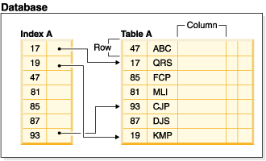
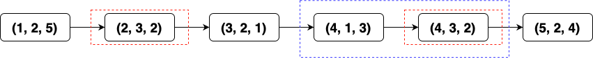
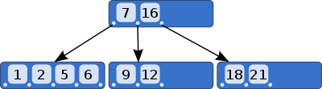
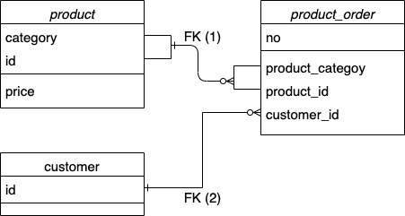
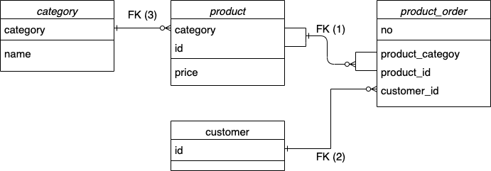

## InnoDB 주요 장점

1. 동작을 수행하는 Commit, 동작 수행 이전 상태로 돌아가는 Rollback과 같은 Transaction 기능을 지원한다.
2. Row-level locking과 Consistent reads를 통해 다중 사용자 환경에서 동시 수행이 가능하다.
3. **물리적 저장 기준인 PRIMARY KEY를 통한 Clustered index 기능을 제공한다.**
4. **데이터 무결성을 보장하기 위한 FOREIGN KEY 기능을 제공한다.**  


&nbsp;&nbsp;이번 포스팅은 지난 포스팅에 이어서 주요 장점 3, 4번에 대해 다룰 것입니다. 나머지 주요 장점들을 이해하기 위해서 먼저 Index와 Key에 대한 이해가 필요합니다. 그러므로 인덱스를 충분히 설명한 뒤에 장점들에 대해 다루도록 하겠습니다.


# Index
---

&nbsp;&nbsp;데이터의 저장된 위치를 일련의 기준으로 정렬하여 저장한 자료구조를 의미합니다. 인덱스와 테이블의 관계는 아래의 그림과 같습니다.



&nbsp;&nbsp;현재 인덱스는 테이블의 첫 번째 컬럼을 기준으로 오름차순 정렬되어있는 것을 볼 수 있습니다. 테이블의 물리적인 저장 순서와는 다르게 인덱스로 지정한 컬럼들의 값을 기준으로 정렬되어있어 **필요한 데이터를 빠르게 찾을 수 있도록 도와주는 역할**을 수행합니다. 또한, 인덱스를 통해 **테이블에 대한 제약조건을 정의**할 수 있습니다. 예를 들어 UNIQUE, PRIMARY 인덱스를 정의함으로써 구성된 컬럼을  조건으로 사용한 조회에 대한 성능 향상뿐만 아니라 모든 행이 다른 값으로 삽입되도록 하는 제약 조건을 통해 데이터 무결성을 확보할 수 있습니다.

- **KEY**  
    **제약 조건을 정의하는 인덱스를 구성하는 컬럼들의 집합**을 말합니다. 인덱스는 하나 이상의 컬럼을 통해 정의할 수 있으며, SQL문으로 특정 제약조건을 만족하는 컬럼을 키로 가지는 인덱스를 선언하여 제약조건을 정의할 수 있습니다.  

    ```SQL
    ALTER TABLE index_test ADD CONSTRAINT <인덱스명> PRIMARY KEY (<컬럼명>);
    ```

<br/>

## 인덱스를 사용하는 방식
---

&nbsp;&nbsp;InnoDB가 쿼리를 수행할 때 쿼리문의 조건에 사용할 수 있는 모든 인덱스를 찾습니다. 각 인덱스의 Cardinality에 따라 우선순위가 매겨지고, 가장 적은 행을 탐색할 수 있는 인덱스를 사용합니다. 하지만 인덱스로 정의된 컬럼을 조건으로 사용한다고 해서 모두 빠른 조회를 수행하는 것은 아닙니다. 특히 여러 개의 컬럼을 인덱스로 설정하였을 때, 인덱스를 사용하지 못하는 경우가 많은데요. 아래의 경우를 살펴봅시다.


### 다중 컬럼 인덱스

```SQL
CREATE TABLE index_test (
	x INT NOT NULL, 
	y INT,
	z INT
	INDEX tidx (x, y, z)
) ENGINE = InnoDB;

INSERT INTO index_test VALUES (2, 3, 2), (4, 1, 3), (1, 2, 5), 
	(5, 2, 4), (3, 2, 1), (4, 3, 2);
```

&nbsp;&nbsp;**여러 컬럼을 사용하여 인덱스를 정의할 수 있지만 지정하는 컬럼의 순서가 매우 중요합니다.** 인덱스가 여러 개의 컬럼을 키로 가질 때, 각 컬럼을 독립적으로 고려하지 않고 하나의 값으로 간주하므로 **모든 컬럼의 값들을 튜플 화(x, y, z)하여 정렬**합니다. 이러한 방식으로 인해 위의 예제에서 tidx의 인덱스는 아래의 그림과 같이 정렬되어있습니다. <span class='small-text'>(InnoDB의 인덱스는 B-Tree 구조로, 이처럼 단순한 배열 방식은 아니지만, leaf node는 아래의 그림과 같이 동일하게 정렬되어있기 때문에 이해를 돕기 위해 사용하였습니다.)</span>


&nbsp;&nbsp;정렬 순서를 보면 컬럼 x의 값을 기준으로 먼저 정렬하고 이후에 y, z 컬럼 순의 기준으로 정렬되어있음을 볼 수 있습니다. 이러한 정렬 순서로 인해 2번째 데이터의 y 컬럼의 값이 3번째 데이터의 y 컬럼의 값보다 크지만, 순서상 앞에 있는 것을 볼 수 있습니다. 그렇다면 이제 이러한 인덱스의 정렬 순서가 조회 시에 어떠한 영향을 미치는지 살펴보겠습니다.


- __1. 인덱스의 첫번째 컬럼을 사용한 조회__  
    <br/>
    ```SQL
    EXPLAIN SELECT * FROM index_test WHERE x = 4;
    # +---------------------------------------------------------+ 
    # |      type     |           key         |      rows       |
    # |----------------------------------------------------------
    # |      ref      |          tidx         |        2        |
    # +---------------------------------------------------------+
    ```
    <br/>
    &nbsp;&nbsp;tidx 인덱스의 첫 번째 컬럼을 사용한 쿼리입니다. 해당 쿼리의 실행계획을 살펴보면, 인덱스를 사용하여 6개의 행 중에 2개의 행만 조회하여 결과를 반환한 것을 확인할 수 있습니다. x 컬럼의 순으로 정렬되어있기 때문에 배열상에서 빠르게 찾을 수 있었습니다. 

<br/>
<br/>


- __2. 인덱스의 첫번째 컬럼을 사용하지 않은 조회__  
    <br/>
    ```SQL
    EXPLAIN SELECT * FROM index_test WHERE y = 2;
    # +---------------------------------------------------------+ 
    # |      type       |          key        |      rows       |
    # |----------------------------------------------------------
    # |      index      |         tidx        |        6        |
    # +---------------------------------------------------------+
    ```  
    <br/>

    &nbsp;&nbsp;tidx 인덱스의 두 번째 컬럼만을 사용한 쿼리입니다. 실행 계획을 통해 해당 쿼리가 인덱스를 사용하였으나, 모든 행을 조회하여 결과를 반환한 것을 확인할 수 있습니다. 인덱스로 정의된 컬럼을 사용하였음에도 모든 행을 조회한 이유는 정렬 순서에 있습니다.   
    <br/> 

    

    <br/>

    &nbsp;&nbsp;첫 번째 쿼리의 결과는 파란색 박스, 두 번째 쿼리의 결과는 빨간색 박스로 표현하였습니다. 첫 번째 컬럼을 사용한 쿼리의 결과는 **순서상 연속된 범위에 존재하며, 이외의 순서에서는 값이 존재하지 않는 것을 보장할 수 있기 때문에 해당 범위 이전과 이후 순서에 대해 탐색할 필요가 없습니다.** 하지만 첫 번째 컬럼을 사용하지 않은 쿼리의 경우, **Y 컬럼의 값이 동일하더라도 X 컬럼의 값에 따라 우선 정렬되기 때문에 쿼리의 결과가 연속되지 않습니다. 이로 인해 첫 번째 컬럼을 사용하지 않은 쿼리는 모든 범위에 대해 탐색할 수밖에 없습니다.** 이러한 컬럼 순서 기반 정렬은 (x, y)와 (x, z) 컬럼을 조건으로 사용하는 경우 또한 동일한 방식으로 조회 범위를 제한합니다. 

    <br/>

    ```SQL
    # (x, y) 컬럼 사용
    EXPLAIN SELECT * FROM index_test WHERE x = 4 AND y = 3;
    # +---------------------------------------------------------+ 
    # |      type     |           key         |      rows       |
    # |----------------------------------------------------------
    # |      ref      |          tidx         |        1        |
    # +---------------------------------------------------------+

    # (x, z) 컬럼 사용
    EXPLAIN SELECT * FROM index_test WHERE x = 4 AND z = 2;
    # +---------------------------------------------------------+ 
    # |      type     |           key         |      rows       |
    # |----------------------------------------------------------
    # |      ref      |          tidx         |        2        |
    # +---------------------------------------------------------+

    # OR 조건 사용은 범위의 제한이 발생하지 않습니다.
    SELECT * FROM index_test WHERE x = 4 OR y = 4;
    # +---------------------------------------------------------+ 
    # |      type       |          key        |      rows       |
    # |----------------------------------------------------------
    # |      index      |         tidx        |        6        |
    # +---------------------------------------------------------+
    ``` 
    <br/> 

    &nbsp;&nbsp;추가로, **여러 컬럼의 집합으로 인덱스를 정의할 수 있지만 컬럼의 값을 인덱스로 저장하기 때문에 인덱스의 크기가 매우 커질 수 있습니다.** 인덱스가 커지면 테이블의 크기 또한 커질 뿐만 아니라 성능 저하가 발생할 수 있습니다. 여러 컬럼의 값을 함께 사용하여 조회하는 경우, 여러 컬럼의 값을 사용하여 만든 해시값을 사용한 인덱스를 정의할 수 있습니다. 이럴 때, 단일 컬럼이며 해시값을 통해 인덱스의 크기를 줄일 수 있기 때문에 더 빠른 조회가 가능하게 됩니다.

<br/>
<br/>
<br/>

## 인덱스 저장 구조
---

&nbsp;&nbsp;지금까지 인덱스를 표현한 그림에서는 단순히 정렬된 배열 형태로 표현되었지만, 실제로 InnoDB의 인덱스는 B-Tree 구조를 가집니다. 비교를 위해 Hash 구조의 인덱스에 대해서도 함께 설명합니다. 하지만 InnoDB는 Hash 구조의 인덱스는 지원하지 않습니다.

### B-Tree



> **이진 트리를 확장해 하나의 노드가 가질 수 있는 자식 노드의 최대 숫자가 2보다 큰 트리 구조를 의미한다.**

&nbsp;&nbsp;그림을 보면 이전에 인덱스를 설명한 것과 동일하게 B-Tree의 leaf node는 그 값들이 모두 정렬된 것을 볼 수 있습니다. 하지만 빠르게 조회의 범위를 좁혀나갈 수 있도록 중간 구분 값(또는 저장된 값)들을 부모 노드로 사용합니다. 이러한 트리 구조는 조회, 삽입, 삭제의 시간 복잡도를 log(N)에 수행할 수 있도록 합니다. 예를 들어 컬럼의 값 12를 인덱스를 사용하여 조회하는 것을 생각해봅시다.

1. 인덱스로 정의된 컬럼을 조건으로 사용하기 때문에 루트 노드 (7, 16)에서 조회를 시작합니다.  
    <br/>
2. 조건의 컬럼값 12가 루트 노드에 존재하는지 확인합니다.     
    <br/>  
3. 존재하지 않기 때문에 이후 X ≤ 7, 7 < X < 16, X ≥ 16의 범위에서 어디에 속하는지 확인합니다.    
    <br/>
4. 7 < X < 16의 범위에 존재하기 때문에 중간의 인덱스가 가리키고 있는 자식 노드로 이동합니다.  
    <br/>
5. 조건의 컬럼값 12가 자식 노드에 존재하는지 확인합니다.   
    <br/>
6. 존재하지 않기 때문에 X ≤ 9, 9 < X < 12, X ≥ 12의 범위에서 어디에 속하는지 확인합니다.  
    <br/>
7. X ≥ 12의 범위에 속하고, 현재의 노드가 leaf node이기 때문에 해당 범위에서부터 순차적으로 탐색하여 12를 찾습니다.  
    
&nbsp;&nbsp;이진 탐색 트리와 유사한 방식으로, 단일 값에 대한 조회뿐 만 아니라 범위를 조건으로 사용하는 조회에 대해서도 효율적입니다. $=$, $>$, $>=$, $<$, $<=$, or `BETWEEN` 연산자에 대해 인덱스를 사용할 수 있습니다.또한 문자열 조회 시, `LIKE` 연산자는 범위에 대한 조회 방식을 사용하기 때문에 해당 연산자 또한 동일하게 인덱스를 사용할 수 있습니다.

### Hash

&nbsp;&nbsp;'key- value' 형식의 해쉬 구조로 인덱스를 저장하여 사용합니다. 이러한 구조는 $=$,  $<=>$ 과 같은 동치 비교 연산에 대해 매우 빠르게 동작하지만, 이외의 비교 연산에 대해서는 인덱스가 사용되지 않습니다. 또한 여러 개의 컬럼으로 인덱스를 정의할 수 있지만 사용되는 컬럼의 값을 모두 사용하여 해시값을 만들기 때문에 반드시 정의된 모든 컬럼을 사용한 조회에서만 인덱스를 사용할 수 있습니다.

<br/>
<br/>
<br/>

# 3. Clustered Index
---

&nbsp;&nbsp;PRIMARY Key(기본 키)의 Index를 의미합니다. Primary Index가 아닌 Clustered Index인 이유는 **데이터의 물리적인 저장구조가 해당 인덱스를 기준으로 클러스터되어 저장**되기 때문입니다. 실제로 InnoDB는 모든 테이블의 데이터를 해당 테이블의 Clustered Index를 기준으로 정렬하여 해당 인덱스를 통한 조회에 최적화되어 저장합니다. <span class='small-text'>(이는 일반적인 인덱스의 역할과는 조금 다릅니다.)</span> 그러므로 **조회의 속도를 높이기 위해서는 Clustered Index를 설정하는 PRIMARY KEY를 자주 사용하는 트랜잭션의 유형에 따라 적절하게 설정하는 것이 중요**합니다. 실제로 단순히 인덱스 설정만으로도 조회에 대한 성능을 크게 향상할 수 있습니다.

- Clustered Index는 제약조건이라는 하나의 '개념'이기 때문에 직접 설정하는 것이 아닌 Primary Key에 의해 설정됩니다.
- 데이터를 삽입할 때, 인덱스에 대한 정보도 함께 저장해야 하기 때문에 삽입에 대한 성능은 (미비하게) 저하될 수 있습니다. 하지만 인덱스를 설정하여 오는 삽입의 성능 저하보다 조회의 속도 향상의 이점이 훨씬 높습니다.

<br/>

### PRIMARY KEY

&nbsp;&nbsp;'기본 키'는 Clustered Index를 구성하는 컬럼의 집합입니다. 기본 키는 PRIMARY의 제약조건을 만족해야 하는데, 제약조건은 아래와 같습니다.

- __기본 키의 컬럼들의 값은 모든 행을 구별할 수 있도록 유일한 값이어야 합니다. (UNIQUE INDEX)__
- __여러 개의 컬럼으로 구성될 수 있으나, 구성되는 모든 컬럼은 NULL을 사용할 수 없다. (NOT NULL)__

기본 키에 대한 추가적인 설명입니다.

- **1. 모든 테이블에 대해 기본 키를 반드시 정의해야합니다.**  

    &nbsp;&nbsp;이는 Clustered Index를 통한 데이터의 저장구조를 정의하기 위함입니다. 기본 키의 조건을 만족하는 컬럼이 존재하지 않으면 AUTO INCREMENT 컬럼을 생성하여 사용하는 것이 일반적입니다. 물론 기본 키를 설정하지 않으면 내부적으로 유일 키 중에서 제약조건을 만족하는 컬럼을 사용하거나 아예 보이지 않는 기본 키를 생성하여 사용하기도 합니다. 

<br/>

- **2. 기본키를 컬럼의 갯수나 형식의 크기를 최소화하여 정의하는 것이 좋습니다.**

    &nbsp;&nbsp;InnoDB는 모든 보조 인덱스에 기본 키의 컬럼을 추가하여 사용합니다. 이러한 특성으로 인해 기본 키의 크기가 클수록 보조 인덱스 또한 그 크기가 커지게 됩니다. 인덱스가 커질수록 쿼리의 성능 저하가 발생할 수 있기 때문에 기본 키를 최소화하여 정의하는 것이 중요합니다. 아래의 예제를 통해 기본 키와 보조 인덱스의 수행방식을 설명해보도록 하겠습니다.  
    <br/>
    ```SQL
    CREATE TABLE t1 (
    i1 INT NOT NULL DEFAULT 0,
    i2 INT NOT NULL DEFAULT 0,
    i3 INT NOT NULL DEFAULT 0,
    d DATE DEFAULT NULL,
    PRIMARY KEY (i1, i2),
    INDEX k_d (d)
    ) ENGINE = InnoDB;

    INSERT INTO t1 VALUES 
        (1, 3, 10, '2021-07-13'),
        (1, 4, 10, '2021-07-13'),
        (6, 9, 11, '2021-07-13'),
        (2, 4, 12, '2021-07-14'),
        (3, 5, 12, '2021-07-11');

    EXPLAIN SELECT * FROM t1 where d = '2021-07-13' and i1 = 1;
    # +--------------------------------------------------------+ 
    # |       type       |         key         |      rows     |
    # |---------------------------------------------------------
    # |   index_merge    |     k_d, PRIMARY    |        2      |
    # +--------------------------------------------------------+

    EXPLAIN SELECT * FROM t1 where d = '2021-07-13' and i3 = 10;
    # +----------------------------------------------------+ 
    # |     type   |     key     |   key_len  |    rows    |
    # |-----------------------------------------------------
    # |     ref    |     k_d     |      4     |      3     |
    # +----------------------------------------------------+
    ```  
    <br>

    &nbsp;&nbsp;`k_d` 인덱스의 키로 정의된 컬럼은 d뿐이지만, 기본 키의 컬럼과 인덱스의 컬럼을 함께 조건으로 사용하는 경우, 쿼리의 성능이 더 좋습니다. 반면에 기본키 컬럼을 조건으로 사용하지 않는 조회의 경우, `k_d` 인덱스만 사용합니다. 이 때, 인덱스의 길이인 `key_len`을 보면, 분명 `k_d` 인덱스의 키는 d컬럼으로, 인덱스 길이는 3(11일, 13일, 14일)이어야 합니다. 하지만 길이가 4인 것으로 볼 때, k_d 인덱스가 (d, i1, i2)를 키로 사용한 (d, i1)컬럼의 값인 (13, 1), (13, 6), (14, 2), (11, 3)으로 구성되어 있을 것으로 예상할 수 있습니다. 


### 이외의 인덱스 종류

- **Secondary Index (보조 인덱스)**  
  
    &nbsp;&nbsp;Clustered Index이외의 모든 인덱스를 말합니다.

<br/>

- **UNIQUE INDEX**   

    &nbsp;&nbsp;UNIQUE INDEX는 UNIQUE KEY(유일 키)를 통해 정의할 수 있으며 해당 인덱스는 모든 행을 구분할 수 있는 제약조건을 정의합니다. 제약조건은 아래와 같습니다.  

    - __유일 키의 컬럼들의 값은 모든 행을 구별할 수 있도록 유일한 값이어야 합니다. (UNIQUE INDEX)__
    - __단, NULL이 허용됩니다.__

    유일 키는 NOT NULL의 제약조건이 추가되는 경우, 기본 키가 될 수 있습니다.


<br/>
<br/>
<br/>

# 4. FOREIGN KEY
--- 

&nbsp;&nbsp;외래키는 **테이블 간의 데이터의 동일성 제약조건을 정의**하기 위해 사용됩니다. 외래키의 제약조건은 자식 테이블에서 외래키로 설정된 컬럼들의 값이 반드시 부모 테이블의 컬럼의 값을 사용하도록 강제합니다. 이를 통해 부모 테이블과 자식 테이블 간의 데이터 동일성을 만족하게 됩니다. 제품 - 주문 - 고객 테이블 예제를 통해 알아보도록 하겠습니다.


```SQL
CREATE TABLE product (
    category INT NOT NULL, id INT NOT NULL,
    price DECIMAL,
    PRIMARY KEY(category, id)
)   ENGINE=INNODB;

CREATE TABLE customer (
    id INT NOT NULL,
    PRIMARY KEY (id)
)   ENGINE=INNODB;

CREATE TABLE product_order (
    no INT NOT NULL AUTO_INCREMENT,
    product_category INT NOT NULL,
    product_id INT NOT NULL,
    customer_id INT NOT NULL,

    PRIMARY KEY(no),
    INDEX (product_category, product_id),
    INDEX (customer_id),
		
		# 외래키 정의
    FOREIGN KEY (product_category, product_id)
      REFERENCES product(category, id)
      ON UPDATE CASCADE ON DELETE RESTRICT,

    FOREIGN KEY (customer_id)
      REFERENCES customer(id)
)   ENGINE=INNODB;
```

&nbsp;&nbsp;위의 SQL문을 통해 테이블과 인덱스, 외래키까지 정의하였습니다. 테이블들의 관계를 ERD 다이어그램으로 그려보면 아래와 같이 그릴 수 있습니다.




&nbsp;&nbsp;그림에서 주문 테이블(`product_order`)와 상품 테이블(`product`) `FK(1)`의 표현을 보시면 1: N 관계임을 알 수 있습니다. 자식 테이블인 주문 테이블의 (`product_category`, `product_id`) 컬럼의 값은 반드시 부모 테이블인 상품 테이블의 (`category`, `id`) 컬럼에 동일한 값이 존재해야 합니다. 두 테이블 간의 관계는 두 가지를 보장하게 됩니다.

1. __주문한 제품이 없는 주문은 존재하지 않습니다.__  

2. __모든 주문은 회사가 취급하는 제품(제품 테이블에 존재하는 제품)에 대한 주문입니다.__

&nbsp;&nbsp;이러한 **추상적인 관계의 제약을 데이터베이스에 적용하기 위해** 외래키를 사용하는 것입니다. 외래키는 주문이 진행되어 주문 테이블의 행 삽입 시마다 외래키를 통해 제품 테이블의 컬럼값을 확인하는 과정을 거칩니다. 이 과정에서 위의 두 관계를 만족시키지 못하는 경우에는 데이터의 동일성을 유지하기 위해 행이 삽입되지 않습니다. 이와 마찬가지로 주문한 고객이 없는 주문은 있을 수 없기 때문에 `FK(2)`에 의해 주문 테이블의 `customer_id` 컬럼의 값은 반드시 고객(`customer`) 테이블의 `id` 컬럼에 동일한 값이 존재해야 합니다.  

+ 여담으로, 제품 테이블의 기본 키를 (category, id) 순으로 사용하는 것으로 보아 제품 각각에 대한 조회보다 카테고리별 조회가 빈번하게 발생하는 경우라고 생각해볼 수 있겠습니다.


<br/>

### FOREIGN KEY 추가

```SQL
ALTER TABLE child_tbl_name
    ADD [CONSTRAINT [symbol]] FOREIGN KEY
    [index_name] (col_name, ...)
    REFERENCES parent_tbl_name (col_name,...)
    [ON DELETE reference_option]
    [ON UPDATE reference_option]

reference_option:
    RESTRICT | CASCADE | SET NULL | NO ACTION | SET DEFAULT
```

외래키의 추가는 자식 테이블에서 정의합니다.<span class='small-text'>(관계를 정의할 대상인 부모 테이블이 존재해야 하기 때문에 어찌 보면 당연합니다..)</span>

- `CONSTRAINT [symbol]` 의 경우, 외래키 제약조건의 이름을 정의하기 위해 사용하며 생략할 수 있으나 이름을 통해 제약조건의 의미를 바로 알아볼 수 있도록 생략하는 것을 피하는 것이 좋습니다.  

- *`reference_option`* 을 통해 제약조건에 의해 부모 테이블의 관계가 정의된 컬럼값의 수정, 삭제 시의 반영방식을 정의 할 수 있습니다.  

  1. __CASCADE__  
      부모 테이블의 컬럼 값의 수정, 삭제가 자식 테이블의 컬럼에도 동일하게 반영됩니다.   
    <br/>
  2. __SET NULL__  
      부모 테이블의 컬럼 값의 수정, 삭제시 자식 테이블의 컬럼 값은 NULL을 가집니다.  
    <br/>
  3. __RESTRICT__  
      수정, 삭제 시 InnoDB의 default 옵션으로, 외래키로 정의된 부모 테이블의 컬럼의 수정, 삭제하지 못하도록 막습니다. NO ACTION 옵션도 같게 동작합니다.  
    <br/>

<br/>

### 사용시 장점

&nbsp;&nbsp;외래키의 사용이 성능에 대한 이점을 가져다주지는 않습니다. 오히려 삽입 시마다 부모 테이블에 대해 존재 여부를 확인하는 과정을 거쳐야 하기 때문에 성능상 손해라고 볼 수 있습니다. 두 테이블을 외래키를 통해 조인하는 경우, 성능상의 이점을 가진다고 볼 수 있겠지만 이것은 외래키의 사용이 아닌 외래키의 생성 조건에 해당하는 '부모 테이블의 외래키에는 인덱스가 존재하여야 한다'에 의한 것입니다. 조인된 테이블에 대한 조회 시 해당 인덱스를 사용하기 때문입니다. 하지만 **테이블 간의 관계를 제약조건을 통해 데이터베이스가 데이터의 동일성을 유지함으로써 구현할 수 있고, 이는 곧 데이터 무결성을 보장**한다고 할 수 있겠습니다. 

<br/>

### 사용시 유의사항

&nbsp;&nbsp;하지만 이러한 제약조건을 만족하기 위해서는 유의해야 하는 것들이 있습니다. 

1. **외래키로 정의된 부모 테이블의 컬럼과 자식 테이블의 컬럼은 동일한 형식을 사용합니다.**  
    <br/>
2. **외래키로 정의된 부모 테이블의 컬럼은 반드시 인덱스가 필요합니다.**  
    &nbsp;&nbsp;외래키 제약조건에 의해 자식 테이블의 행 삽입 시마다 부모 테이블의 외래키로 정의된 컬럼의 값에 대해 존재 여부를 확인해야 합니다. 이 과정을 테이블에 대한 조회가 아닌 인덱스를 사용한 조회를 통해 빠르게 수행하기 위해 외래키로 정의된 컬럼에 인덱스가 정의되어야 합니다. 부모 테이블에서 여러 컬럼을 외래키로 사용할 때도 동일하게 외래키로 정의된 맨 처음 컬럼에 대한 인덱스가 존재하여야 합니다.  
    <br/>  
3. **파티셔닝된 테이블에 대해서는 외래키를 사용할 수 없습니다.**    
    <br/>
   
4. **자식 테이블의 외래키 컬럼 값은 반드시 부모 테이블의 외래키 컬럼에 존재하여야 합니다.**  
    &nbsp;&nbsp;매우 당연한 이야기처럼 들리지만, 지켜지지 않는 경우가 꽤 있습니다. 예를 들어, 앞의 예제에서 아래의 ERD 다이어그램과 같이 카테고리만 따로 모아두는 테이블이 생성되었다고 생각해봅시다.

    

    새로운 카테고리의 제품을 판매하려는 상황을 가정합니다. 이때 카테고리 테이블에 새로운 카테고리 삽입과 제품 테이블에 대한 새로운 카테고리의 물품 삽입을 동시에 실행하려고 하게 되면 간혹 카테고리 테이블에 삽입이 되기 전에 제품 테이블 삽입이 진행되면서 제약조건에 의해 삽입되어야 할 제품들이 누락되는 경우가 발생할 수 있습니다. (생각보다 쉽게 발생할 수 있습니다..)외래키 제약조건의 사용을 고려할 때에는 **반드시 부모 테이블에 대한 초기화가 선행되는 작업일 경우**에만 사용하거나 동시에 작업이 수행되지 않도록 예외처리를 해둬야 합니다.

<br/>
<br/>
<br/>


# 정리

이번 포스팅에서는 InnoDB의 3, 4번 장점에 관해 설명하였습니다. 저번 포스팅과 동일하게 기능 구현에서 적용할 수 있는 것들을 정리해보겠습니다.

### 3. Clustered Index

- 해당 테이블에서 빈번하게 사용되는 트랜잭션의 조회조건을 파악하여 적합한 기본 키를 설정합니다.
- 여러 개의 컬럼을 키로 사용하는 경우, 최소 조건이 되는 컬럼을 가장 빠른 순으로 정의합니다.

### 4. FOREIGN KEY

- 두 테이블 간 동일성이 유지되어야 하는 컬럼에 대해서 외래키를 사용합니다.
- 조인이 필요한 테이블에 조인 기준 컬럼을 외래키로 정의합니다.


# 참고자료

[1] 인덱스와 테이블의 구조 이미지 [https://www.ibm.com/support/producthub/db2/docs.html](https://www.ibm.com/support/producthub/db2/docs/content/SSEPGG_11.5.0/com.ibm.db2.luw.admin.dbobj.doc/doc/c0023327.html)

[2] 외래키 [https://dev.mysql.com/doc/refman/5.6/en/create-table-foreign-keys.html](https://dev.mysql.com/doc/refman/5.6/en/create-table-foreign-keys.html)

<br/>
<br/>
<br/>
